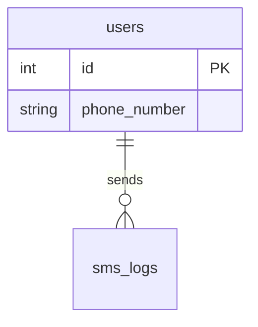

# Documentation Standards & Diagrams

## Documentation Rules

- **User-facing docs**: Keep `README.md` updated with installation, usage, API endpoints, and configuration parameters.
- **Developer-facing docs**: Keep `DEV_README.md` updated with architecture, development setup, workflow, and testing strategy.

## Mermaid Diagrams

Use Mermaid diagrams for visual documentation of schemas, class structures, and flows.

### Mermaid `erDiagram` Rules
Mermaid `erDiagram` is sensitive to syntax:

- **Single physical line**: ALL relationship declarations MUST be written on a single physical line without line breaks inside the definition.
- **Tabs**: Avoid tabs in Mermaid diagrams.
- **Labels**: Prefer simple ASCII labels (e.g., `contains`, `belongs_to`, `has_many`, `references`, `targets`). Avoid quotes unless required.

#### Correct Example:

