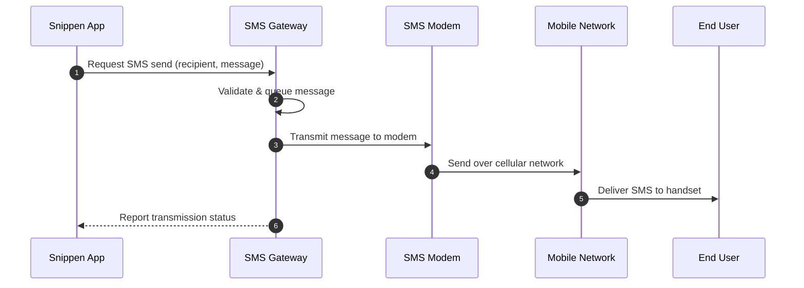
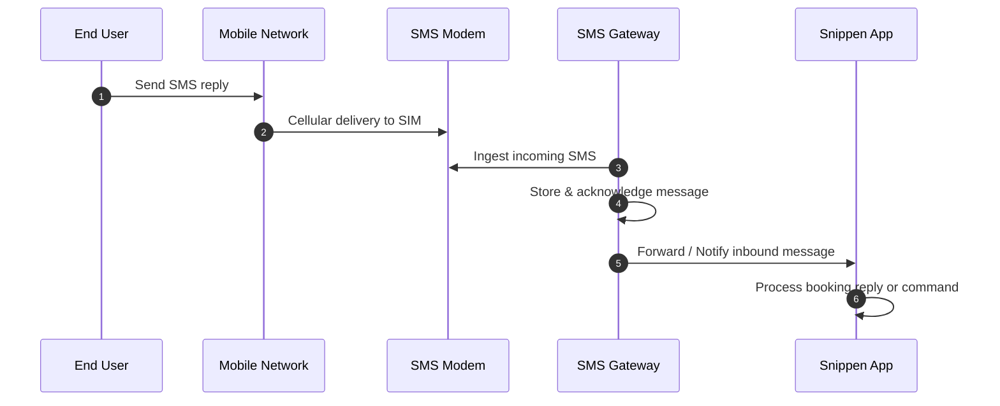
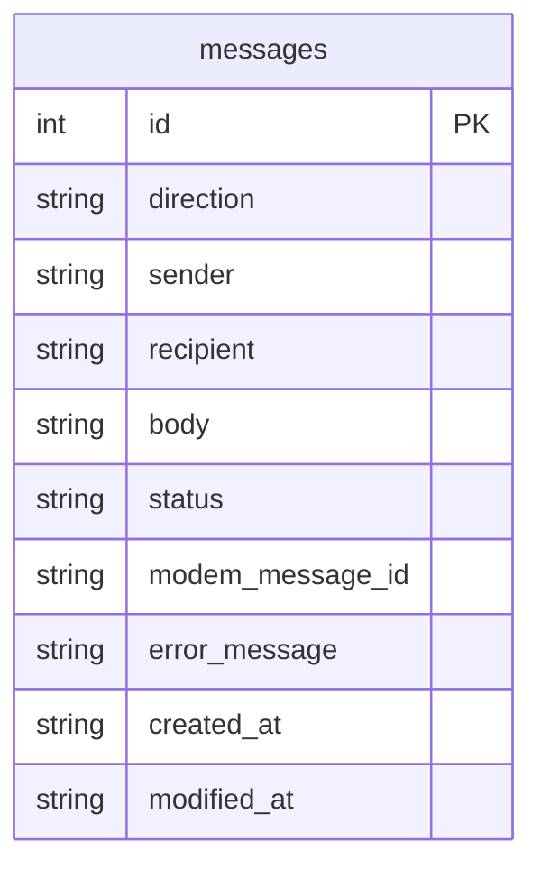

# Architecture & System Design

## Overview & Purpose

The **Snippen SMS Gateway** is a dedicated service designed to provide a reliable, cost-effective two-way SMS communication channel for the **Snippen** booking and management platform.

Rather than relying on costly third-party cloud messaging aggregators for ongoing high-volume SMS operations, the gateway connects to a local cellular SMS modem with a standard SIM subscription. This provides Snippen with direct control over its messaging infrastructure while significantly reducing per-message operational costs.

---

## Relationship to Snippen

The SMS Gateway operates as an independent subsystem with a clear separation of concerns from the main Snippen booking application:

- **Snippen Booking Platform**:
  - Contains core domain logic, booking lifecycles, customer data, and messaging triggers (e.g., reservation confirmations, check-in instructions, reminders).
  - Decides *when* and *to whom* messages are sent, and *how* incoming customer responses affect bookings.
  - Remains entirely agnostic of hardware details, AT commands, serial ports, and cellular transmission logistics.

- **Snippen SMS Gateway**:
  - Acts as the dedicated bridge between Snippen and the cellular SMS hardware.
  - Manages outbound message queueing, transmission timing, delivery status tracking, and error recovery.
  - Ingests inbound messages from the cellular modem and exposes them for Snippen to consume.
  - Monitors modem health, signal quality, and cellular connection status.

---

## Communication Flow

The gateway facilitates two-way communication between Snippen and end users over the mobile network:

### 1. Outbound Message Flow (Notifications & Inquiries)

1. **Send Request**: Snippen submits an outbound message with recipient phone number and content.
2. **Queueing & Rate Management**: The gateway stages the message, respecting network timing and modem capacity.
3. **Hardware Dispatch**: The gateway instructs the SMS modem to transmit the payload.
4. **Network Delivery**: The modem delivers the message over the mobile network to the end user.
5. **Status Reporting**: The gateway records transmission results (success, failure, or retry) and makes status available to Snippen.

---

### 2. Inbound Message Flow (Guest Replies & Inbound Requests)

1. **Message Arrival**: The end user replies via SMS; the carrier delivers the SMS to the SIM card in the modem.
2. **Ingress & Ingestion**: The gateway detects and retrieves the unread message from the modem storage.
3. **Storage & Ack**: The gateway securely records the incoming message and clears or marks it on the modem storage to prevent duplicates and overflow.
4. **Notification / Forwarding**: The gateway makes the inbound message available to Snippen for business processing and conversational handling.

---

## Key Responsibilities & System Boundaries

| Responsibility | Handled By SMS Gateway | Handled By Snippen |
| :--- | :---: | :---: |
| Booking logic & customer state | ❌ | ✅ |
| Determining recipient phone number & message text | ❌ | ✅ |
| Interpreting message intent / customer replies | ❌ | ✅ |
| Modem hardware communication & port handling | ✅ | ❌ |
| Outbound dispatch queueing & rate limiting | ✅ | ❌ |
| Cellular signal & SIM status monitoring | ✅ | ❌ |
| Inbound message detection & retrieval | ✅ | ❌ |
| Hardware fault detection & modem reconnection | ✅ | ❌ |

---

## Local Message Persistence

To ensure zero message loss during network interruptions or service restarts, the SMS Gateway employs a lightweight, embedded SQLite database backend. Messages are persisted locally before and after transmission or ingestion.

### Data Model & Schema

- **Persistence Layer (`MessageStorage`)**: Built on Python standard library `sqlite3` using Write-Ahead Logging (`WAL`) mode for robust, concurrent reads and writes without external database server dependencies.
- **Timestamp Tracking**: Every record maintains ISO-8601 UTC `created_at` and `modified_at` timestamps for auditing, synchronization, and retry workflows.

---

## Architectural Principles

1. **Hardware Isolation**:
   Physical modem communication (e.g., serial connections, AT commands, USB disconnections) is fully encapsulated within the gateway so changes to modem hardware do not affect the main Snippen platform.

2. **Fault Tolerance & Resilience**:
   Cellular networks and physical modems can experience temporary dropouts, signal loss, or power cycles. The gateway is designed to safely queue messages, retry on transient failures, and recover connectivity gracefully.

3. **Loose Coupling**:
   Communication between Snippen and the SMS Gateway is kept clean, lightweight, and decoupled, allowing either service to be updated, restarted, or tested independently.

4. **Extensibility**:
   While designed for physical SMS modems, the high-level architecture accommodates mock modems for local testing, multiple SIM cards, or backup providers in the future without altering the core messaging contracts.
