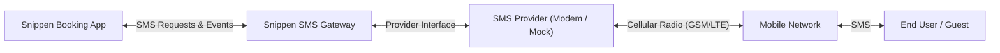
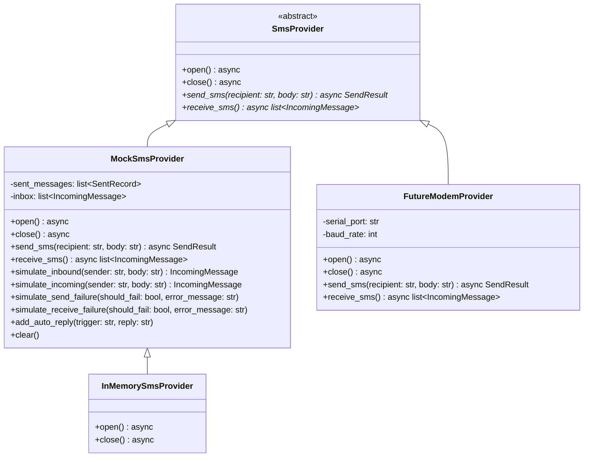
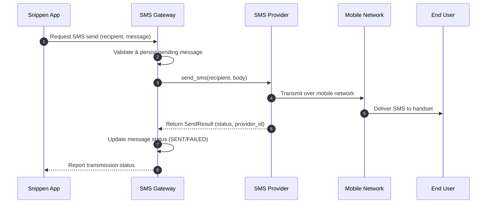
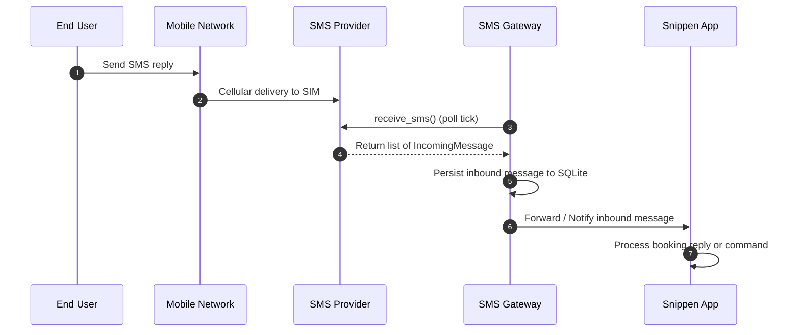
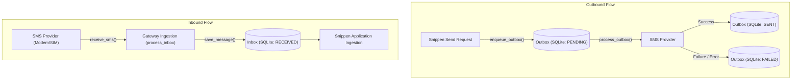
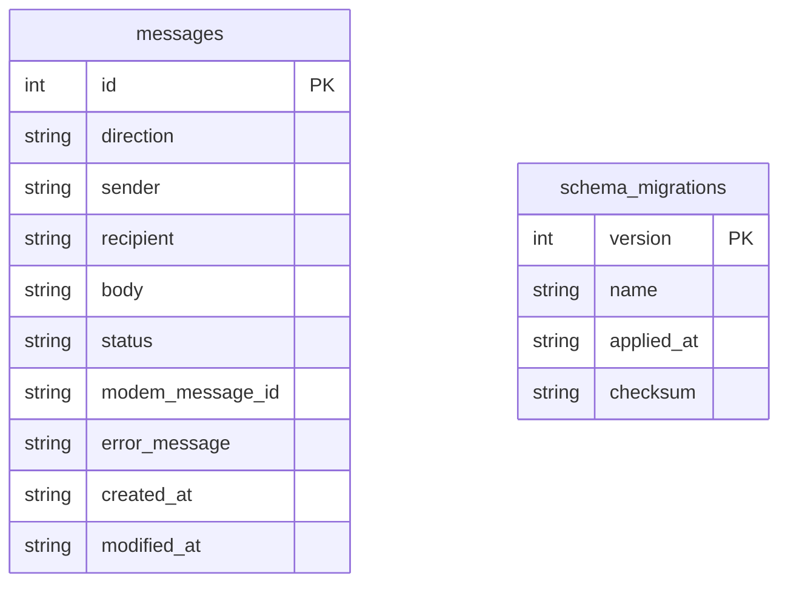
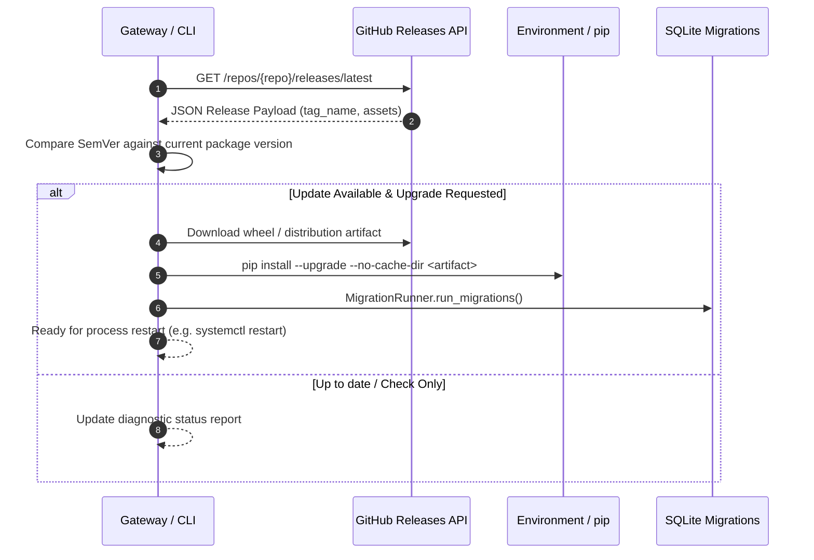

# Architecture & System Design

## Overview & Purpose

The **Snippen SMS Gateway** is a dedicated service designed to provide a reliable, cost-effective two-way SMS communication channel for the **Snippen** booking and management platform.

Rather than relying on costly third-party cloud messaging aggregators for ongoing high-volume SMS operations, the gateway connects to an SMS provider abstraction (such as a local cellular SMS modem with a standard SIM subscription). This provides Snippen with direct control over its messaging infrastructure while significantly reducing per-message operational costs.

---

## Relationship to Snippen

The SMS Gateway operates as an independent subsystem with a clear separation of concerns from the main Snippen booking application:

- **Snippen Booking Platform**:
  - Contains core domain logic, booking lifecycles, customer data, and messaging triggers (e.g., reservation confirmations, check-in instructions, reminders).
  - Decides *when* and *to whom* messages are sent, and *how* incoming customer responses affect bookings.
  - Remains entirely agnostic of hardware details, AT commands, serial ports, and cellular transmission logistics.

- **Snippen SMS Gateway**:
  - Acts as the dedicated bridge between Snippen and the SMS provider backend.
  - Manages outbound message queueing, transmission timing, delivery status tracking, and error recovery.
  - Ingests inbound messages from the SMS provider and exposes them for Snippen to consume.
  - Monitors provider health, signal quality, and cellular connection status.

---

## SMS Provider Abstraction Layer

To ensure the gateway remains completely decoupled from physical hardware (such as specific modem chipsets or serial AT commands) or external vendors, all message transmission and ingestion operations are mediated by the `SmsProvider` abstraction layer:

### Abstraction Components

1. **`SmsProvider` (Abstract Base Class)**:
   - `send_sms(recipient, body)`: Asynchronously dispatches an SMS message, returning a `SendResult`.
   - `receive_sms()`: Asynchronously fetches and drains unread incoming SMS messages from the provider/modem, returning a list of `IncomingMessage` instances.
   - `open()` / `close()`: Manages hardware and connection lifecycle hooks.

2. **`SendResult` & `IncomingMessage` (Data Transfer Objects)**:
   - `SendResult(success, message_id, error_message)` encapsulates transmission outcomes and hardware identifiers.
   - `IncomingMessage(sender, body, received_at, provider_message_id)` represents inbound cellular messages in a standardized UTC format.

3. **`MockSmsProvider` & `InMemorySmsProvider`**:
   - High-fidelity mock/in-memory provider enabling offline development, CI/CD testing, simulated inbound/outbound scenarios, failure injection, and automated response rules without physical hardware.

4. **Provider Factory & Registry (`get_provider`, `register_provider`)**:
   - Facilitates dynamic instantiation and runtime swapping of providers via configuration or CLI arguments without changing gateway business logic.

---

## Communication Flow

The gateway facilitates two-way communication between Snippen and end users over the mobile network:

### 1. Outbound Message Flow (Notifications & Inquiries)

1. **Send Request**: Snippen submits an outbound message with recipient phone number and content.
2. **Queueing & Persistence**: The gateway records the pending message locally in SQLite.
3. **Provider Dispatch**: The gateway instructs the `SmsProvider` to transmit the payload.
4. **Network Delivery**: The provider delivers the message over the mobile network to the end user.
5. **Status Reporting**: The gateway records transmission results (success, failure, or retry) and makes status available to Snippen.

---

### 2. Inbound Message Flow (Guest Replies & Inbound Requests)

1. **Message Arrival**: The end user replies via SMS; the carrier delivers the SMS to the provider.
2. **Ingress & Ingestion**: The gateway polls unread messages from `SmsProvider.receive_sms()`.
3. **Storage & Ack**: The gateway securely records the incoming message in SQLite.
4. **Notification / Forwarding**: The gateway makes the inbound message available to Snippen for business processing and conversational handling.

---

## Key Responsibilities & System Boundaries

| Responsibility | Handled By SMS Gateway | Handled By Snippen |
| :--- | :---: | :---: |
| Booking logic & customer state | ❌ | ✅ |
| Determining recipient phone number & message text | ❌ | ✅ |
| Interpreting message intent / customer replies | ❌ | ✅ |
| Provider & modem communication abstraction | ✅ | ❌ |
| Outbound dispatch queueing & rate limiting | ✅ | ❌ |
| Cellular signal & SIM status monitoring | ✅ | ❌ |
| Inbound message detection & retrieval | ✅ | ❌ |
| Hardware fault detection & provider reconnection | ✅ | ❌ |

---

## Message Outbox & Inbox Architecture

To provide high reliability and prevent message loss when communication or the SMS provider is temporarily unavailable, `snippen-sms-service` implements local transactional outbox and inbox patterns backed by SQLite storage.

### Outbox Processing
1. **Persistent Enqueueing**: Outgoing messages are enqueued to the local SQLite database as `PENDING` records via `MessageStorage.enqueue_outbox()` before any provider transmission is attempted.
2. **Batch / Polling Dispatch**: The gateway dispatches pending outbox records via `GatewayService.process_outbox()`. This runs during active sends and on every heartbeat tick of the gateway run loop.
3. **Failure Isolation & Non-Destructive Error Handling**: If provider delivery fails or network timeouts occur, the message status is updated to `FAILED` with detailed diagnostic error messages. Messages are never silently deleted or lost.
4. **Service Restart Resilience**: Any pending outbox messages persist across gateway restarts and will be processed once the service restarts and the SMS provider is available.

### Inbox Ingestion
1. **Provider Polling**: The gateway periodically polls the SMS provider (`SmsProvider.receive_sms()`) via `GatewayService.poll_incoming_messages()` (or `process_inbox()`).
2. **Local Storage**: Each inbound SMS is immediately persisted into the local SQLite database with `direction=inbound`, `status=received`, timestamp, and provider identifiers.

---

## Local Message Persistence

To ensure zero message loss during network interruptions or service restarts, the SMS Gateway employs a lightweight, embedded SQLite database backend. Messages are persisted locally before and after transmission or ingestion.

### Data Model & Schema

- **Persistence Layer (`MessageStorage`)**: Built on Python standard library `sqlite3` using Write-Ahead Logging (`WAL`) mode for robust, concurrent reads and writes without external database server dependencies.
- **Timestamp Tracking**: Every record maintains ISO-8601 UTC `created_at` and `modified_at` timestamps for auditing, synchronization, and retry workflows.
- **Migration Management (`MigrationRunner`)**: Sequential SQL migration scripts managed atomically with `schema_migrations` tracking, SHA-256 checksum verification, `PRAGMA user_version` synchronization, and automatic execution upon service initialization.

---

## Software Version Checking & Self-Update Architecture

The gateway features built-in release tracking against the official GitHub Releases API to keep field deployments up-to-date.

### Key Update Capabilities
1. **Zero-Dependency Release Checking**: Uses Python's standard `urllib` to query GitHub API with configurable repository defaults (`jonasfh/snippen-sms-service`) and environment overrides (`SNIPPEN_SMS_GITHUB_REPO`).
2. **Safe, Non-Looping Startup Check**: Checks for updates at startup (and periodically in background) without forcing restarts, avoiding reboot crash loops if network conditions or package dependencies encounter issues.
3. **Artifact-Based Upgrade**: Discovers and downloads wheel (`.whl`) or tarball distributions, installs via `pip`, and automatically executes any new SQLite schema migrations.
4. **CLI Management**: Direct command-line access via `snippen-sms check-update` and `snippen-sms update`.

---

## Architectural Principles

1. **Hardware Isolation**:
   Physical modem communication (e.g., serial connections, AT commands, USB disconnections) is fully encapsulated within the provider abstraction so changes to modem hardware do not affect the gateway or the main Snippen platform.

2. **Fault Tolerance & Resilience**:
   Cellular networks and physical modems can experience temporary dropouts, signal loss, or power cycles. The gateway is designed to safely queue messages, retry on transient failures, and recover connectivity gracefully.

3. **Loose Coupling**:
   Communication between Snippen and the SMS Gateway is kept clean, lightweight, and decoupled, allowing either service to be updated, restarted, or tested independently.

4. **Extensibility**:
   While designed for physical SMS modems, the high-level architecture accommodates mock modems for local testing, multiple SIM cards, or backup cloud providers in the future without altering the core messaging contracts.
