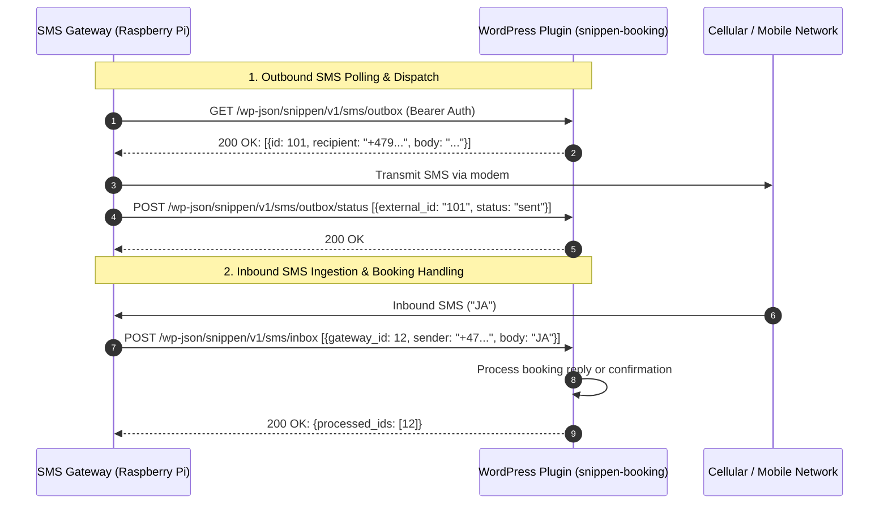

# Snippen Booking WordPress Plugin - SMS API Integration Specification & Tasks

## Overview & Architecture

The **Snippen SMS Gateway** (running on Raspberry Pi or standalone server) acts as a cellular bridge to send and receive SMS messages on behalf of the **Snippen Booking Platform** (`snippen-booking` WordPress plugin on `https://vestreholmensameie.no`).

To ensure simplicity, security, and ease of deployment behind NAT and cellular firewalls, **all HTTP communication is initiated by the Raspberry Pi / SMS Gateway**. Snippen never needs to make inbound requests to the Raspberry Pi.



---

## Authentication & Security

1. **Authentication Mechanism**:
   - The Gateway sends an API token in the standard `Authorization: Bearer <token>` header as well as an optional `X-API-Key: <token>` header on every request.
   - The WordPress plugin stores a shared secret token in WordPress options (`snippen_sms_api_token`) or constant (`SNIPPEN_SMS_API_TOKEN` in `wp-config.php`).
   - Every endpoint verifies this token in its `permission_callback`. If invalid or missing, return HTTP 401 Unauthorized (`rest_forbidden` or `rest_unauthorized`).

2. **WordPress Permission Callback Example**:
   ```php
   function snippen_sms_rest_permission_check(WP_REST_Request $request): bool|WP_Error {
       $auth_header = $request->get_header('authorization');
       $api_key_header = $request->get_header('x_api_key');

       $token = '';
       if (!empty($auth_header) && preg_match('/Bearer\s+(.*)$/i', $auth_header, $matches)) {
           $token = trim($matches[1]);
       } elseif (!empty($api_key_header)) {
           $token = trim($api_key_header);
       }

       $expected_token = defined('SNIPPEN_SMS_API_TOKEN')
           ? SNIPPEN_SMS_API_TOKEN
           : get_option('snippen_sms_api_token', '');

       if (empty($expected_token) || !hash_equals($expected_token, $token)) {
           return new WP_Error(
               'rest_forbidden',
               __('Invalid or missing SMS Gateway authentication token.', 'snippen-booking'),
               ['status' => 401]
           );
       }

       return true;
   }
   ```

---

## API Endpoints Specification

Base Namespace: `/wp-json/snippen/v1/sms`

### 1. `GET /wp-json/snippen/v1/sms/outbox`
**Description**: Polled periodically by the gateway to retrieve pending SMS messages scheduled for sending.

- **Method**: `GET`
- **Headers**:
  - `Accept: application/json`
  - `Authorization: Bearer <token>`
- **Response**: `200 OK`
  ```json
  {
    "messages": [
      {
        "id": "105",
        "recipient": "+4791234567",
        "body": "Din booking for Badstue #3 er bekreftet. Kode: 5432.",
        "sender": "Snippen"
      }
    ]
  }
  ```
  *(A direct JSON list `[...]` is also supported by the gateway).*

---

### 2. `POST /wp-json/snippen/v1/sms/outbox/status`
**Description**: Called by the gateway after an outbound message was transmitted (or failed) to update delivery state in Snippen.

- **Method**: `POST`
- **Headers**:
  - `Content-Type: application/json`
  - `Authorization: Bearer <token>`
- **Request Body**:
  ```json
  {
    "statuses": [
      {
        "external_id": "105",
        "gateway_id": 42,
        "status": "sent",
        "error_message": null,
        "modem_message_id": "modem-msg-88"
      }
    ]
  }
  ```
  - `status`: `"sent"` or `"failed"`
- **Response**: `200 OK`
  ```json
  {
    "success": true,
    "updated": 1
  }
  ```

---

### 3. `POST /wp-json/snippen/v1/sms/inbox`
**Description**: Called by the gateway to report newly received inbound SMS messages (guest replies, confirmations, commands) along with resolved booking context.

- **Method**: `POST`
- **Headers**:
  - `Content-Type: application/json`
  - `Authorization: Bearer <token>`
- **Request Body**:
  ```json
  {
    "messages": [
      {
        "gateway_id": 15,
        "sender": "+4791234567",
        "recipient": "snippen-sms-service",
        "body": "JA",
        "booking_id": "105",
        "conversation_id": 3,
        "received_at": "2026-08-30T10:15:30Z",
        "modem_message_id": "modem-in-99"
      }
    ]
  }
  ```
- **Response**: `200 OK`
  ```json
  {
    "success": true,
    "processed_ids": [15]
  }
  ```
  *(The gateway marks messages in `processed_ids` as `processed` so they are not resent).*

---

### 4. `GET /wp-json/snippen/v1/sms/bookings`
**Description**: Polled by the gateway to retrieve active/upcoming bookings for a specific customer phone number when resolving ambiguous incoming SMS context.

- **Method**: `GET`
- **Query Parameters**:
  - `phone`: Customer telephone number in E.164 format (e.g. `+4791234567`)
- **Headers**:
  - `Accept: application/json`
  - `Authorization: Bearer <token>`
- **Response**: `200 OK`
  ```json
  {
    "bookings": [
      {
        "id": "105",
        "customer_name": "Ola Nordmann",
        "start_time": "2026-12-15T16:00:00Z",
        "end_time": "2026-12-15T18:00:00Z",
        "resource_name": "Badstue",
        "status": "confirmed"
      },
      {
        "id": "109",
        "customer_name": "Ola Nordmann",
        "start_time": "2027-01-05T11:00:00Z",
        "resource_name": "Felleslokale",
        "status": "confirmed"
      }
    ]
  }
  ```

---

## Ready-to-use Implementation Tasks for `snippen-booking`

Below are four copy-pasteable tasks/issues to file in the `snippen-booking` WordPress plugin repository.

---

### Task 1: [Feature] Implement SMS Gateway REST API Authentication & Settings

#### Title:
`[Feature] SMS Gateway REST API Authentication & Configuration Settings`

#### Description:
Implement authentication validation and admin settings for the SMS gateway synchronization.

#### Acceptance Criteria:
- [ ] Add admin setting or constant `SNIPPEN_SMS_API_TOKEN` / `get_option('snippen_sms_api_token')`.
- [ ] Add permission callback `snippen_sms_rest_permission_check(WP_REST_Request $request)` checking `Authorization: Bearer <token>` and `X-API-Key: <token>`.
- [ ] Return HTTP 401 with JSON error when authentication is invalid or missing.
- [ ] Unit/integration tests verifying valid and invalid token access.

---

### Task 2: [Feature] Implement Outbound SMS Outbox & Status REST Routes

#### Title:
`[Feature] Implement GET /wp-json/snippen/v1/sms/outbox and POST /wp-json/snippen/v1/sms/outbox/status`

#### Description:
Expose pending SMS queue and allow the SMS Gateway to report message delivery statuses.

#### Acceptance Criteria:
- [ ] Register `GET /wp-json/snippen/v1/sms/outbox`:
  - Queries pending booking notifications / SMS queue.
  - Returns `{"messages": [{"id": "<id>", "recipient": "<e164>", "body": "<text>", "sender": "Snippen"}]}`.
- [ ] Register `POST /wp-json/snippen/v1/sms/outbox/status`:
  - Accepts `{"statuses": [{"external_id": "<id>", "status": "sent"|"failed", "error_message": "<msg>"}]}`.
  - Updates booking / SMS log status in WordPress database.
  - Returns `{"success": true, "updated": <count>}`.
- [ ] Tests verifying polling, status updates, and JSON validation.

---

### Task 3: [Feature] Implement Inbound SMS Ingestion REST Route

#### Title:
`[Feature] Implement POST /wp-json/snippen/v1/sms/inbox for Guest Reply Ingestion`

#### Description:
Receive incoming SMS messages from the SMS Gateway and connect them with booking lifecycles.

#### Acceptance Criteria:
- [ ] Register `POST /wp-json/snippen/v1/sms/inbox`:
  - Accepts `{"messages": [{"gateway_id": <int>, "sender": "<e164>", "body": "<text>", "received_at": "<iso8601>"}]}`.
  - Matches sender phone number against active bookings.
  - Triggers booking state changes (e.g., booking confirmation on "JA", cancellation on "AVBESTILL").
  - Returns `{"success": true, "processed_ids": [<gateway_id>, ...]}`.
- [ ] Deduplicate incoming messages using `gateway_id` or `modem_message_id`.
- [ ] Tests verifying inbound message handling and booking status transitions.

---

### Task 4: [Feature] Implement Customer Bookings Lookup REST Route for Context Resolution

#### Title:
`[Feature] Implement GET /wp-json/snippen/v1/sms/bookings for Context Resolution`

#### Description:
Expose customer active/upcoming bookings by phone number so the SMS Gateway can resolve conversation context.

#### Acceptance Criteria:
- [ ] Register `GET /wp-json/snippen/v1/sms/bookings`:
  - Accepts query parameter `?phone=<e164>`.
  - Queries active, upcoming, or recent bookings for that phone number.
  - Returns `{"bookings": [{"id": "<id>", "customer_name": "<name>", "start_time": "<iso8601>", "end_time": "<iso8601>", "resource_name": "<name>", "status": "confirmed"}]}`.
- [ ] Tests verifying querying bookings by phone number and returning empty list when none match.
